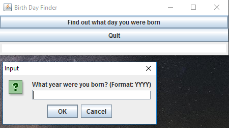

# Day-of-the-week
This finds the day you were born or any other date(e.g Monday)

This is the dayoftheweekfinder

This is where you enter the year

This is where you enter the month

This is where you enter the day

This is where the date is shown

If you put a month or day not in the range, you get an error message and you also get error message for days on february 29 that are not in the leap year.

